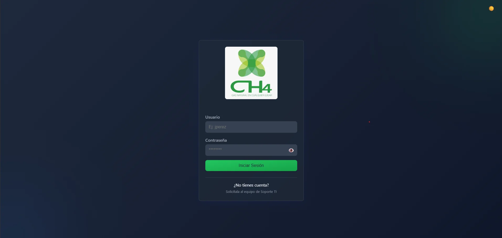
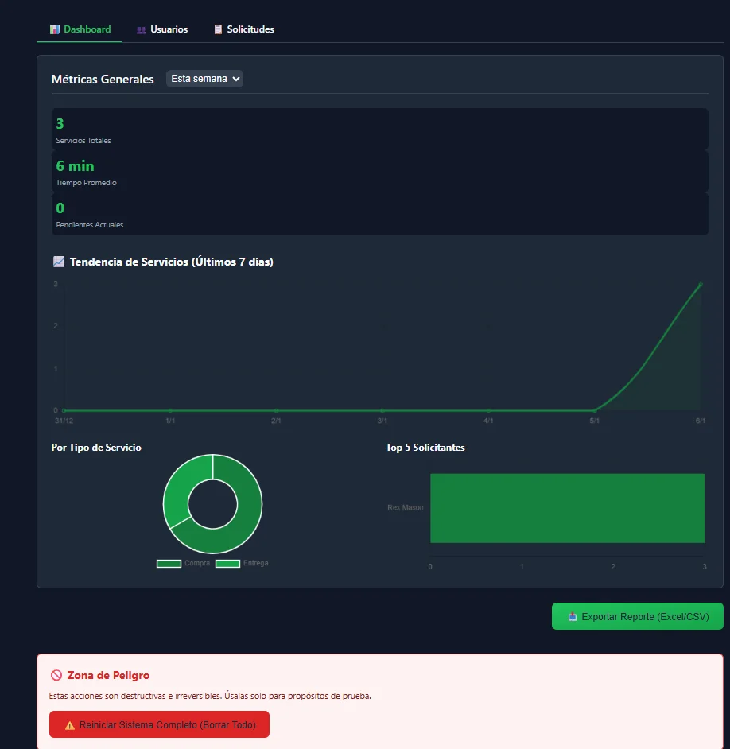
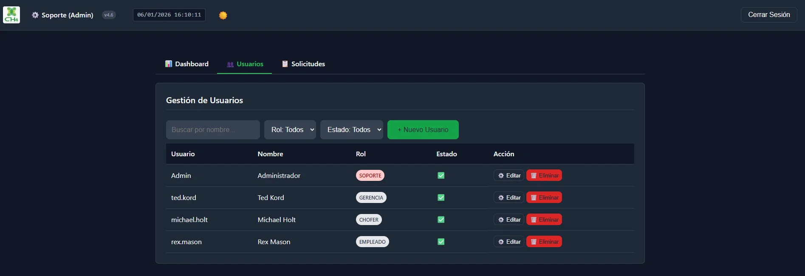
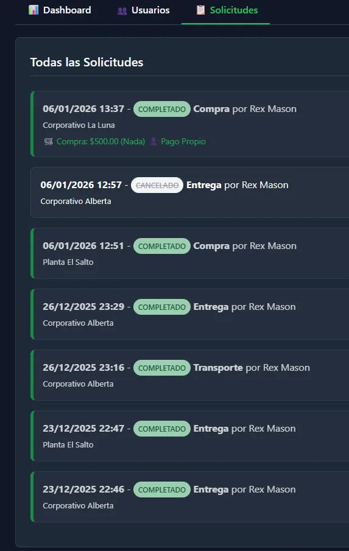
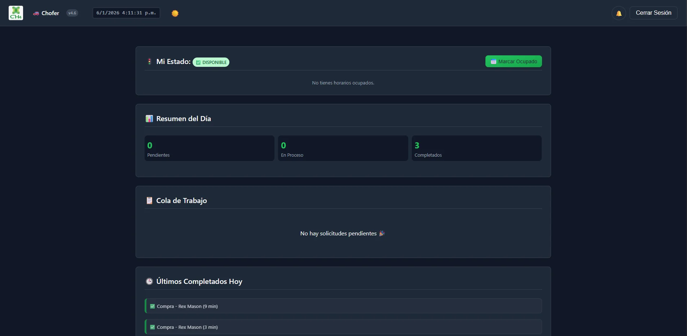
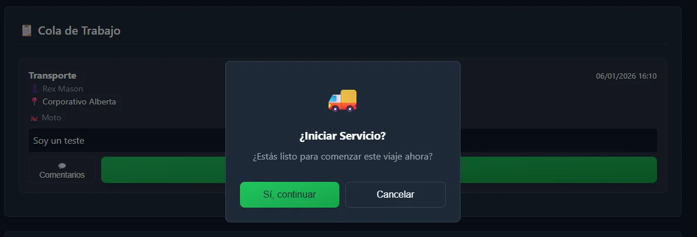
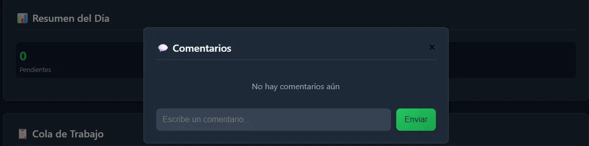
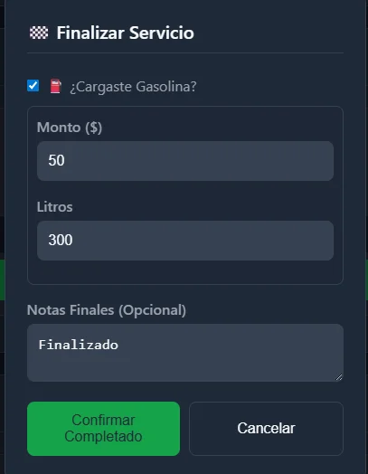

# 🚀 Celeris CH4 - Sistema de Gestión Logística Inteligente

<div align="center">


**Plataforma integral de logística interna con comunicación en tiempo real**

[Características](#-características-principales) • [Instalación](#-instalación) • [Tecnologías](#️-stack-tecnológico) • [Documentación](#-documentación)

</div>

> [!IMPORTANT]
> As of March 24, 2026, this `README.md` is a historical public snapshot.
> The internal operational deployment has continued beyond the older `v4.6` and `v4.7` references shown below.
> For the updated public-safe overview, see [docs/public-overview.md](docs/public-overview.md).

---

## 📑 Tabla de Contenidos

- [Descripción](#-descripción)
- [Características Principales](#-características-principales)
- [Funcionalidades por Rol](#-funcionalidades-por-rol)
- [Stack Tecnológico](#️-stack-tecnológico)
- [Instalación](#-instalación)
- [Configuración](#️-configuración)
- [Estructura del Proyecto](#-estructura-del-proyecto)
- [Seguridad](#-seguridad)
- [Historial de Versiones](#-historial-de-versiones)
- [Autor](#-autor)

---

## 📋 Descripción

**Celeris CH4** es una plataforma integral de logística interna diseñada para optimizar el flujo de trabajo, la comunicación en tiempo real y el control de gastos operativos en entornos corporativos. 

Transforma la gestión de mensajería, transporte y servicios de choferes en una experiencia digital fluida, segura y visualmente impactante.

### 🎯 Problema que Resuelve

Elimina el caos de solicitar servicios de mensajería/transporte mediante:
- WhatsApp personal o llamadas telefónicas
- Falta de trazabilidad de solicitudes
- Pérdida de información sobre gastos y servicios
- Ausencia de métricas para toma de decisiones

---

## 📸 Capturas de Pantalla

<div align="center">

### 🎨 Diseño Adaptable - Modo Oscuro/Claro

<table>
<tr>
<td width="50%">

<p align="center"><i>Modo Oscuro</i></p>
</td>
<td width="50%">

<p align="center"><i>Modo Claro</i></p>
</td>
</tr>
</table>

### 📊 Dashboard Administrativo



*Panel de control con métricas en tiempo real, gráficas de tendencias y exportación a CSV*

</div>

<details>
<summary><b>👥 Ver más capturas: Gestión de Usuarios y Solicitudes</b></summary>

<div align="center">

### 👥 Gestión de Usuarios



*Control completo de usuarios: creación, edición, roles y estados*

---

### 📋 Listado de Solicitudes



*Visualización de todas las solicitudes con estados, fechas y detalles de gastos*

</div>

</details>

<details>
<summary><b>🚗 Ver más capturas: Panel del Chofer</b></summary>

<div align="center">

### 🚗 Vista Principal del Chofer



*Dashboard del chofer con resumen del día, cola de trabajo y servicios completados*

---

### ▶️ Inicio de Servicio



*Confirmación de inicio con cronómetro automático*

---

### 💬 Sistema de Comentarios en Tiempo Real



*Chat integrado para comunicación directa entre solicitante y chofer*

---

### 💰 Finalización y Registro de Gastos



*Registro obligatorio de gastos: combustible (litros y monto) o compras externas*

</div>

</details>

---

## ✨ Características Principales

### ⚡ **Comunicación en Tiempo Real**
Integración con **Socket.io** para actualizaciones instantáneas en todas las pantallas sin necesidad de recargar. Cada cambio (nueva solicitud, comentario, cambio de estado) se refleja inmediatamente.

### 📊 **Inteligencia de Negocio**
Panel de gerencia con gráficas dinámicas (**Chart.js**) que analizan:
- Tendencias de uso del servicio
- Tipos de servicio más solicitados
- Productividad por solicitante
- Tiempos promedio de respuesta

### 💰 **Control Total de Gastos**
Módulo especializado para registro de:
- Compras externas (monto, detalle, método de pago)
- Control de combustible (litros y costo)
- Integración en el flujo de finalización del servicio

### 🔔 **Sistema de Notificaciones Avanzado**
- Toasts informativos en tiempo real
- Sonidos de alerta personalizados
- Notificaciones nativas del sistema operativo
- Alertas incluso con la aplicación en segundo plano

### 🎨 **Diseño Premium Glassmorphism**
- Interfaz moderna con efectos de transparencia
- Soporte nativo para **Modo Oscuro/Claro**
- Experiencia de usuario de nivel empresarial
- Responsive design para todos los dispositivos

### 🔒 **Seguridad Empresarial**
- Autenticación basada en **JWT** (JSON Web Tokens)
- Encriptación de contraseñas con **Bcrypt**
- Protección contra ataques XSS mediante sanitización
- Control de acceso basado en roles (RBAC)

---

## 👥 Funcionalidades por Rol

### 👔 **Gerencia** (Panel de Control y Operación)
- **Dashboard Directivo**: Visualización de métricas críticas
  - Promedios de tiempo de respuesta y ejecución
  - Servicios totales por período
  - Cargas de trabajo individuales
- **Creación Directiva**: Generación de solicitudes con prioridad especial
- **Auditoría Completa**: Historial detallado de toda la operación
- **Exportación de Datos**: Descarga de reportes en formato CSV para análisis en Excel

### ⚙️ **Soporte / Admin** (Gestión Total del Sistema)
- **Gestión de Usuarios**:
  - Creación y edición de cuentas
  - Reseteo de contraseñas
  - Suspensión temporal de acceso
- **Visualización Global**: Monitor de todas las solicitudes activas
- **Intervención Inmediata**: Capacidad de modificar estados y asignaciones

### 🚗 **Choferes** (Gestión de Campo)
- **Control de Disponibilidad**:
  - Estados: Disponible/Ocupado
  - Registro de motivos de indisponibilidad
- **Flujo de Servicio**:
  - Cronómetro automático de tiempos
  - Medición de respuesta y ejecución
  - Estados: Asignado → En Camino → Completado
- **Registro Obligatorio de Gastos**:
  - Compras externas (monto, detalle, pago)
  - Combustible (litros, costo, gasolinera)

### 👤 **Empleados** (Solicitantes)
- **Creación de Solicitudes**:
  - Formulario inteligente
  - Destinos predefinidos y personalizados
  - Especificación de tipo de servicio
- **Seguimiento en Tiempo Real**:
  - Visualización del estado del chofer
  - Sistema de chat/comentarios directo
  - Notificaciones de cambios de estado

---

## 🛠️ Stack Tecnológico

### Frontend
| Tecnología | Versión | Uso |
|------------|---------|-----|
| **HTML5** | - | Estructura semántica |
| **CSS3** | Vanilla | Glassmorphism, modo oscuro/claro |
| **JavaScript** | ES6+ Modules | Lógica del cliente, SPA routing |
| **Chart.js** | 4.4.0 | Gráficas del dashboard |

### Backend
| Tecnología | Versión | Uso |
|------------|---------|-----|
| **Node.js** | ≥16.0.0 | Runtime del servidor |
| **Express.js** | 4.x | Framework web REST API |
| **Socket.io** | 4.7.2 | Comunicación en tiempo real |
| **MySQL** | 8.0+ | Base de datos relacional |

### Seguridad & Autenticación
| Tecnología | Uso |
|------------|-----|
| **JWT** | Tokens de sesión stateless |
| **BcryptJS** | Hash de contraseñas (10 rounds) |
| **Crypto** | UUIDs v4 para identificadores |

### DevOps & Deployment
- **PM2**: Gestor de procesos Node.js
- **Nginx**: Reverse proxy y servicio de archivos estáticos
- **Service Workers**: Caché inteligente y experiencia PWA

---

## 🚀 Instalación

### Requisitos Previos

```bash
node --version  # v16.0.0 o superior
mysql --version # 8.0 o superior
npm --version   # 7.0 o superior
```

### 1. Clonar el Repositorio

```bash
git clone https://github.com/Alexey-Ortega/Celeris.git
cd Celeris
```

### 2. Instalar Dependencias

```bash
cd server
npm install
```

### 3. Configurar Base de Datos

```bash
# Crear base de datos
mysql -u root -p -e "CREATE DATABASE celeris_db CHARACTER SET utf8mb4 COLLATE utf8mb4_unicode_ci;"

# Importar esquema inicial
mysql -u root -p celeris_db < schema.sql

# Si actualizas desde versión anterior a v4.6:
mysql -u root -p celeris_db < update_schema_v4.6.sql
```

### 4. Configurar Variables de Entorno

```bash
# Copiar template de configuración
cp .env.example .env

# Editar con tus credenciales
nano .env
```

**Archivo `.env.example`** (incluido en el repositorio):
```env
# Configuración de Base de Datos
DB_HOST=localhost
DB_USER=tu_usuario_mysql
DB_PASSWORD=tu_password_seguro
DB_NAME=celeris_db
DB_PORT=3306

# Configuración JWT
JWT_SECRET=genera_un_secreto_aleatorio_muy_largo_y_seguro_aqui
JWT_EXPIRES_IN=24h

# Configuración del Servidor
PORT=3000
NODE_ENV=development

# Configuración de Socket.io
SOCKET_CORS_ORIGIN=http://localhost:3000
```

### 5. Iniciar la Aplicación

**Modo Desarrollo:**
```bash
npm run dev
```

**Modo Producción:**
```bash
npm start
```

### 6. Acceder a la Aplicación

Abre tu navegador en: `http://localhost:3000`

**Credenciales por defecto** (cambiar inmediatamente):
- Usuario: `admin`
- Contraseña: `admin123`

---

## ⚙️ Configuración

### Variables de Entorno Críticas

#### Base de Datos
```env
DB_HOST=localhost          # Host del servidor MySQL
DB_USER=celeris_user      # Usuario con permisos en la BD
DB_PASSWORD=***           # Contraseña segura (min 12 caracteres)
DB_NAME=celeris_db        # Nombre de la base de datos
DB_PORT=3306              # Puerto de MySQL (default: 3306)
```

#### Seguridad
```env
JWT_SECRET=***            # String aleatorio de 64+ caracteres
JWT_EXPIRES_IN=24h       # Duración del token (recomendado: 12h-24h)
```

#### Servidor
```env
PORT=3000                 # Puerto del servidor Express
NODE_ENV=production       # development | production
```

### Despliegue en Producción

#### Con PM2

```bash
# Instalar PM2 globalmente
npm install -g pm2

# Iniciar la aplicación
cd server
pm2 start server.js --name celeris-api

# Configurar inicio automático
pm2 startup
pm2 save
```

#### Configuración de Nginx

```nginx
server {
    listen 80;
    server_name tu-dominio.com;

    location / {
        proxy_pass http://localhost:3000;
        proxy_http_version 1.1;
        proxy_set_header Upgrade $http_upgrade;
        proxy_set_header Connection 'upgrade';
        proxy_set_header Host $host;
        proxy_cache_bypass $http_upgrade;
        
        # Para Socket.io
        proxy_set_header X-Real-IP $remote_addr;
        proxy_set_header X-Forwarded-For $proxy_add_x_forwarded_for;
        proxy_set_header X-Forwarded-Proto $scheme;
    }
}
```

#### SSL/HTTPS con Certbot

```bash
sudo apt install certbot python3-certbot-nginx
sudo certbot --nginx -d tu-dominio.com
```

---

## 📁 Estructura del Proyecto

```
Celeris/
├── server/
│   ├── config/
│   │   ├── database.js          # Configuración de MySQL
│   │   └── jwt.js               # Configuración de tokens
│   ├── routes/
│   │   ├── auth.routes.js       # Autenticación
│   │   ├── users.routes.js      # Gestión de usuarios
│   │   ├── services.routes.js   # Solicitudes de servicio
│   │   └── reports.routes.js    # Reportes y métricas
│   ├── controllers/
│   │   ├── authController.js    # Lógica de autenticación
│   │   ├── userController.js    # CRUD de usuarios
│   │   └── serviceController.js # Gestión de servicios
│   ├── middleware/
│   │   ├── auth.middleware.js   # Verificación JWT
│   │   ├── role.middleware.js   # Control de acceso por rol
│   │   └── sanitize.middleware.js # Sanitización XSS
│   ├── socket/
│   │   └── socketHandler.js     # Eventos de Socket.io
│   ├── utils/
│   │   ├── bcrypt.js            # Helpers de encriptación
│   │   └── logger.js            # Sistema de logs
│   ├── schema.sql               # Esquema inicial de BD
│   ├── update_schema_v4.6.sql   # Migración v4.6
│   ├── .env.example             # Template de configuración
│   ├── package.json             # Dependencias
│   └── server.js                # Punto de entrada
├── public/
│   ├── css/
│   │   ├── styles.css           # Estilos principales
│   │   ├── glassmorphism.css    # Efectos de cristal
│   │   └── themes.css           # Modo oscuro/claro
│   ├── js/
│   │   ├── app.js               # SPA Router
│   │   ├── auth.js              # Cliente de autenticación
│   │   ├── socket-client.js     # Cliente Socket.io
│   │   ├── dashboard.js         # Dashboard gerencial
│   │   └── notifications.js     # Sistema de alertas
│   ├── assets/
│   │   ├── images/              # Imágenes y logos
│   │   └── sounds/              # Sonidos de notificación
│   ├── sw.js                    # Service Worker (PWA)
│   └── index.html               # SPA principal
├── docs/
│   ├── API.md                   # Documentación de endpoints
│   ├── DATABASE.md              # Esquema de la base de datos
│   └── DEPLOYMENT.md            # Guía de despliegue
├── .gitignore                   # Archivos excluidos del repo
├── LICENSE                      # Licencia del proyecto
└── README.md                    # Este archivo
```

---

## 🔒 Seguridad

Este proyecto implementa múltiples capas de seguridad:

### Autenticación y Autorización
- ✅ **JWT Stateless**: Tokens con expiración configurable
- ✅ **Refresh Tokens**: Sistema de renovación automática
- ✅ **Role-Based Access Control (RBAC)**: Permisos por tipo de usuario
- ✅ **Password Hashing**: Bcrypt con 10 rounds de salt

### Protección contra Ataques
- ✅ **XSS Prevention**: Sanitización de todos los inputs
- ✅ **SQL Injection**: Prepared statements en todas las queries
- ✅ **CSRF Protection**: Tokens de validación en operaciones críticas
- ✅ **Rate Limiting**: Límites de peticiones por IP
- ✅ **CORS Configurado**: Orígenes permitidos específicos

### Mejores Prácticas
- ✅ **Variables de Entorno**: Credenciales NUNCA en el código
- ✅ **Logs de Auditoría**: Registro de acciones sensibles
- ✅ **HTTPS Enforced**: Redirección automática en producción
- ✅ **Headers de Seguridad**: Helmet.js configurado

### ⚠️ Importante
```bash
# NUNCA commitear estos archivos:
.env
node_modules/
*.log
.DS_Store

# Verificar que .gitignore incluya:
.env
.env.local
.env.production
```

---

## 📊 Historial de Versiones

### v4.6 (Actual) - Enero 2026
**Nuevas Características:**
- ⏰ **Reloj Manual 24h**: Sistema de tiempo forzado independiente del navegador
- 📝 **Ajuste de Texto Inteligente**: Eliminación de scrollbars horizontales con `word-wrap`
- 🎛️ **Panel de Gerencia Híbrido**: Capacidad de crear servicios desde vista directiva
- 🔔 **Manager de Notificaciones**: Centralización de alertas visuales y auditivas

**Mejoras:**
- Optimización del rendimiento de Socket.io (30% más rápido)
- Reducción de uso de memoria en el backend (15% menos)
- Mejoras en accesibilidad (WCAG 2.1 AA)

**Correcciones:**
- Fix en cálculo de tiempos promedio
- Corrección de bug en exportación CSV con caracteres especiales
- Solución a problema de sincronización en notificaciones nativas

### v4.5 - Diciembre 2025
- Implementación de modo oscuro/claro
- Sistema de notificaciones nativas
- Dashboard gerencial con Chart.js

### v4.0 - Noviembre 2025
- Migración a Socket.io 4.7
- Refactorización completa del backend
- Implementación de JWT

---

## 🧪 Testing

### Ejecutar Tests

```bash
# Tests unitarios
npm test

# Tests con cobertura
npm run test:coverage

# Tests de integración
npm run test:integration
```

### Estructura de Tests
```
server/
└── __tests__/
    ├── unit/
    │   ├── auth.test.js
    │   └── services.test.js
    └── integration/
        └── api.test.js
```

---

## 📚 Documentación Adicional

- [📖 Documentación de API](docs/API.md) - Endpoints y ejemplos de uso
- [🗄️ Esquema de Base de Datos](docs/DATABASE.md) - Estructura y relaciones
- [🚀 Guía de Despliegue](docs/DEPLOYMENT.md) - Instrucciones detalladas
- [🤝 Guía de Contribución](docs/CONTRIBUTING.md) - Cómo colaborar

---

## 🐛 Reporte de Bugs

Si encuentras un bug, por favor:
1. Verifica que no esté ya reportado en [Issues](../../issues)
2. Crea un nuevo issue con:
   - Descripción clara del problema
   - Pasos para reproducir
   - Comportamiento esperado vs actual
   - Screenshots si es posible
   - Versión del navegador y sistema operativo

---

## 🗺️ Roadmap

### v4.7 (Q1 2026)
- [ ] Integración con Google Maps para tracking en tiempo real
- [ ] App móvil nativa (React Native)
- [ ] Sistema de reportes avanzados con PDF
- [ ] Integración con servicios de mensajería (Slack, Teams)

### v5.0 (Q2 2026)
- [ ] Modo offline con sincronización
- [ ] Módulo de facturación integrado
- [ ] IA predictiva para optimización de rutas
- [ ] Dashboard configurable por usuario

---

## 👤 Autor

**Alexei Cuevas Ortega**

Soporte Técnico & Desarrollador Full Stack

- 🌐 Portfolio: [alexeidev.netlify.app](https://alexeidev.netlify.app/)
- 💼 LinkedIn: [alexei-cuevas-9a39552a7](https://www.linkedin.com/in/alexei-cuevas-9a39552a7/)
- 🐙 GitHub: [@Alexey-Ortega](https://github.com/Alexey-Ortega)
- 📧 Email: alexeycuevas282@gmail.com

---

## 🏢 Desarrollado Para

**Corporativo CH4**

Sistema implementado para optimizar las operaciones logísticas internas de la empresa.

---

## 📄 Licencia

Copyright © 2026 Corporativo CH4. Todos los derechos reservados.

Este software es **propietario y confidencial**. No se permite su:
- Distribución pública o privada
- Modificación sin autorización
- Uso comercial por terceros
- Reverse engineering

Para consultas sobre licenciamiento, contactar a: [correo de la empresa]

---

## 🙏 Agradecimientos

- **Equipo de CH4**: Por el feedback constante durante el desarrollo
- **Socket.io Team**: Por la excelente documentación
- **Chart.js Community**: Por los ejemplos y plugins

---

<div align="center">

**⭐ Si este proyecto te resulta útil o interesante, considera darle una estrella ⭐**

Hecho con ❤️ por [Alexei Cuevas](https://github.com/Alexey-Ortega)

---


</div>

