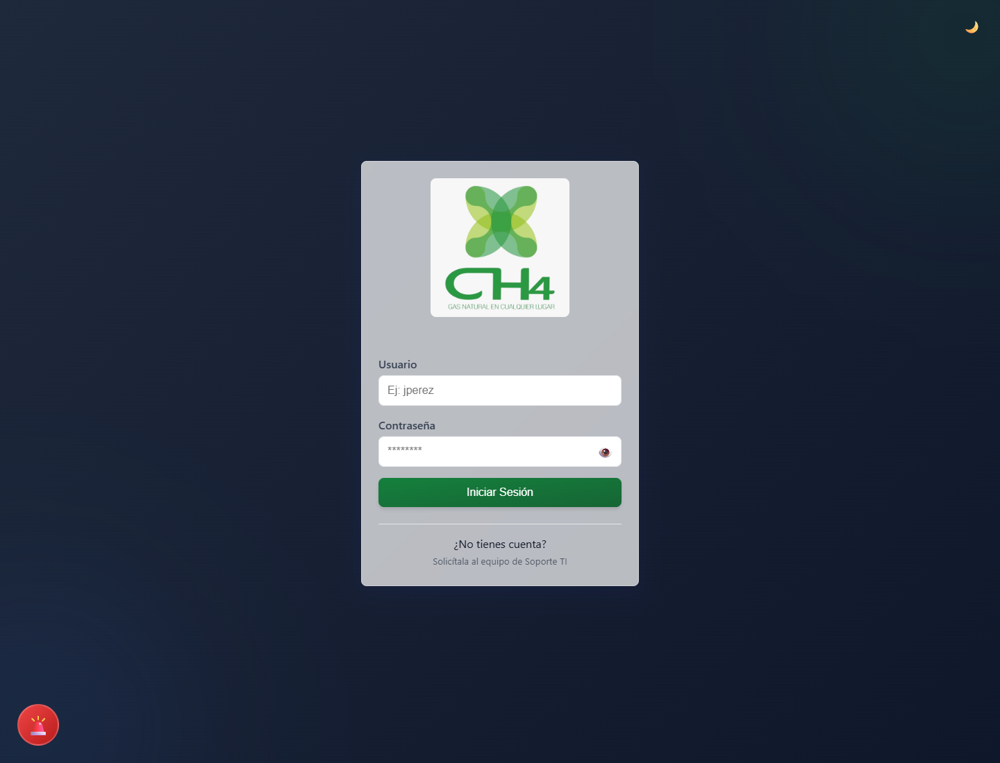
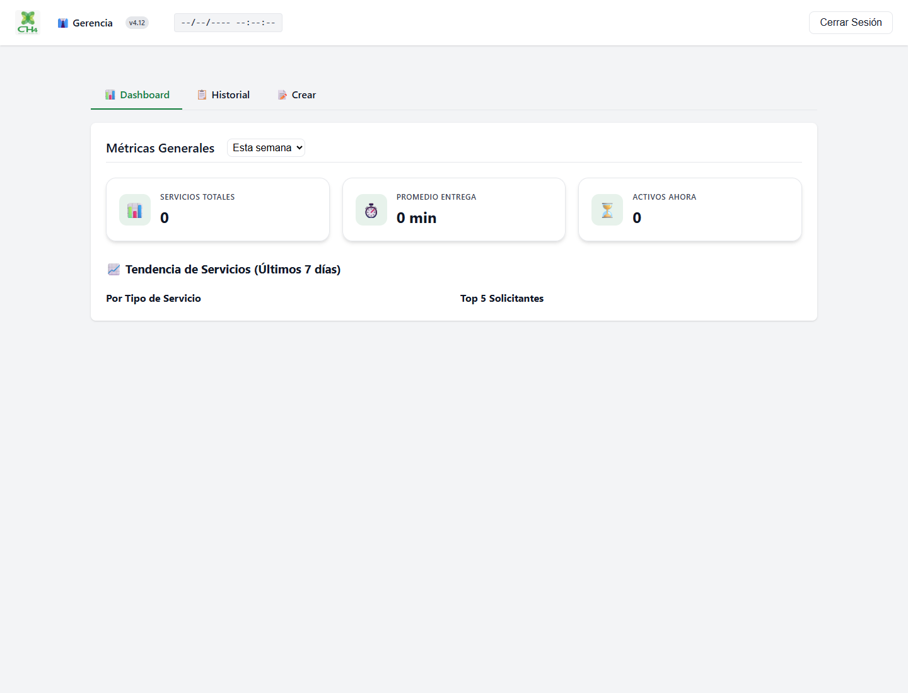

# Celeris CH4

## Resumen

Celeris CH4 es una plataforma de logistica interna orientada a la coordinacion de solicitudes, asignaciones, seguimiento operativo y consulta historica por rol. Esta version publica presenta el producto sin incluir infraestructura privada ni cuentas internas.

## Alcance funcional

- inicio de sesion protegido
- paneles por rol
- creacion y seguimiento de solicitudes
- actualizaciones en tiempo real
- comentarios y seguimiento operativo
- administracion de usuarios
- consulta gerencial y reportes
- exportaciones operativas
- trazabilidad de incidencias

## Roles cubiertos

- soporte
- gerencia
- chofer
- empleado

## Stack tecnico

- Frontend: HTML, CSS y JavaScript modular
- Backend: Node.js con Express
- Base de datos: MySQL
- Tiempo real: Socket.io
- Graficas: Chart.js
- Exportacion: utilidades XLSX y PDF
- Autenticacion: JWT

## Flujo de uso

1. El usuario inicia sesion.
2. La aplicacion lo redirige a su panel segun el rol.
3. Desde cada vista se crean, atienden o concluyen solicitudes.
4. Los cambios se reflejan en tiempo real para el resto de usuarios conectados.
5. La gerencia puede consultar historicos, indicadores y exportaciones.

## Capturas publicas

Vista de acceso:

Vista gerencial de ejemplo:

## Nota de publicacion

- Esta documentacion fue sanitizada para GitHub.
- Se omitieron dominios internos, IPs, rutas de despliegue y credenciales operativas.
- Las cuentas internas y la documentacion privada se mantienen fuera de este repositorio.
